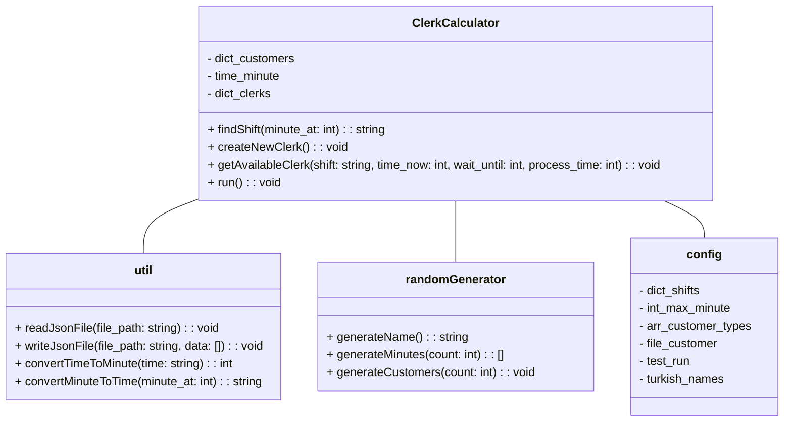
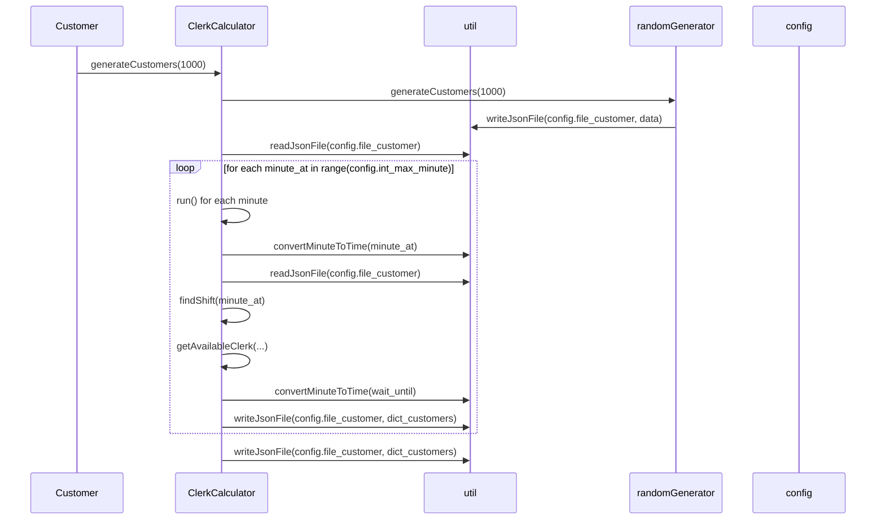

# Welcome to our CENG303 Project!

Hi! Our project is **Banking Clerks with Python**. 

                                                                           |

# Contributors

No sorting for contributors.

- [M. Duhan Güler](https://github.com/duhanguler)
- [Firuza Rahimova](https://github.com/firagimova)
- [Erham Safa Aksoy](https://github.com/ErhamSafa)
- [Murat Ergin](https://github.com/MurattErginn)
- [Mehmet Yalçın](https://github.com/aviascerate)

## How to use?


**Operating system:** OSX or Linux is recommended although Windows is also supported.

### 1. Install global dependencies


To check if python3, pip and some of libraries (json, random) is already installed:

```bash
python3 --version
```

<details>
	<summary><b>Install Python3</b></summary>

To install python3 follow instructions [here](https://www.python.org/downloads/)

To install pip - follow instructions [here](https://pip.pypa.io/en/stable/installation/)

</details>
<details>
<summary><b>Install json and random libraries</b></summary>

**Any installation method is fine.**

Recommended:

```bash
python3 -m pip install --user --upgrade pip
python3 -m pip install --user json
python3 -m pip install --user random
```


</details>


### 2. Install project dependencies

Clone the repo

```bash
git clone https://github.com/duhanguler/ceng303
cd ceng303/
```


_**Note:** If you face a distutils error in pip, use `--ignore-installed` flag in above command._

<!-- Wiki should not get cloned -->

### 3. Run the code

1. Run program:
   ```bash
   python3 main.py
   ```


## UML diagrams

You can render UML diagrams using [Mermaid](https://mermaidjs.github.io/). For example, this will produce a sequence diagram:







